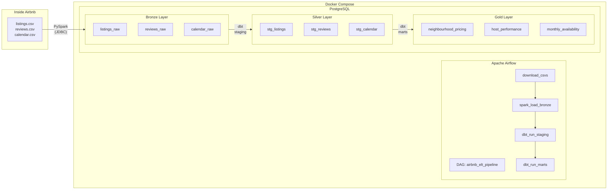

# Airbnb Boston -- ELT Medallion Architecture

## Problem Statement

Analyzing short-term rental market dynamics in Boston to understand pricing factors, host performance, and neighbourhood desirability using Inside Airbnb open data.

## Dataset

Source: [Inside Airbnb -- Boston](https://insideairbnb.com/boston/) (September 2025 snapshot)

| File | Description | Approx Rows |
|------|-------------|-------------|
| listings.csv | Detailed listing info, host data, prices, review scores | ~4.4K |
| reviews.csv | Individual review entries with dates | ~233K |
| calendar.csv | Daily availability and pricing per listing | ~1.6M |

## Pipeline Architecture



### Tool Stack

| Role | Tool |
|------|------|
| Orchestration | Apache Airflow (DAG-based scheduling + UI) |
| Processing Engine | PySpark (local mode, JDBC writer) |
| Transformations | dbt-postgres (staging + marts models) |
| Data Warehouse | PostgreSQL (Dockerized) |

### Medallion Layers

**Bronze (Raw)** -- PySpark loads CSVs as-is, all text columns, via JDBC `mode("overwrite")`

**Silver (Cleaned)** -- dbt staging models: proper types, price parsing, null handling, deduplication

**Gold (Business)** -- dbt mart models: aggregations and JOINs for analytics

| Gold Table | Description | Source |
|------------|-------------|--------|
| `neighbourhood_pricing` | AVG/median price, count, avg rating per neighbourhood + room type | stg_listings |
| `host_performance` | Host metrics with verified review counts | stg_listings JOIN stg_reviews |
| `monthly_availability` | Monthly availability rate by neighbourhood | stg_calendar JOIN stg_listings |

## Setup & Run

### Prerequisites
- Docker + Docker Compose

### Quick Start
```bash
# 1. Copy environment file
cp .env.example .env

# 2. Start all services (PostgreSQL + Airflow)
docker compose up -d

# 3. Open Airflow UI and trigger the DAG
open http://localhost:8080
# Login: admin / admin (auto-created by Airflow standalone)
# Navigate to airbnb_elt_pipeline -> Trigger DAG
```

### CLI Alternative (without UI)
```bash
docker compose exec airflow airflow dags trigger airbnb_elt_pipeline
```

### Tear Down
```bash
docker compose down -v
```

### Local Development (without Docker Airflow)
```bash
docker compose up postgres -d
pip install -r requirements.txt
python spark/ingest.py all
cd dbt_project && dbt run --profiles-dir .
```

## Idempotency

| Layer | Strategy |
|-------|----------|
| Download | Skips if CSV already exists on disk |
| Bronze | PySpark JDBC `mode("overwrite")` -- atomic table replace |
| Silver/Gold | dbt manages table lifecycle (no manual DROP CASCADE) |
| Schemas | `CREATE SCHEMA IF NOT EXISTS` (never drops) |
| DAG | Re-triggerable at any time, produces same result |

## Data Quality Risks

### 1. Missing Values / Nulls
Many listings lack `review_scores_rating`, `host_response_rate`, and `neighbourhood_group`. Approximately 25% of listings have no review scores at all. This affects silver layer completeness and can skew gold layer aggregations.

### 2. Price Format Inconsistency & Outliers
Price is stored as a string (`"$1,250.00"`) requiring parsing. Some listings have `$0.00` or extreme values (>$10,000/night) that distort mean-based aggregations.

### 3. Temporal Data Staleness & Duplicates
Calendar data is a point-in-time snapshot. Reviews may contain duplicates from overlapping scrape runs. Listings marked "active" could be abandoned profiles.

## Project Structure

```
bgd-s24170/
├── docker-compose.yml              # PostgreSQL + Airflow
├── airflow/Dockerfile              # Airflow image with Java + PySpark + dbt
├── .env.example                    # Environment template
├── requirements.txt                # Python dependencies
│
├── dags/
│   └── airbnb_elt_pipeline.py      # Airflow DAG definition
│
├── spark/
│   └── ingest.py                   # PySpark: download CSVs + load bronze via JDBC
│
├── dbt_project/
│   ├── dbt_project.yml             # dbt configuration
│   ├── profiles.yml                # PostgreSQL connection
│   ├── macros/                     # Schema name override
│   └── models/
│       ├── staging/                # Bronze -> Silver (stg_listings, stg_reviews, stg_calendar)
│       └── marts/                  # Silver -> Gold (neighbourhood_pricing, host_performance, monthly_availability)
│
├── diagrams/                       # Architecture diagrams (ERD + high-level)
├── sql/                            # Original SQL scripts (Assignment 1 reference)
├── src/                            # Original Python modules (Assignment 1 reference)
└── main.py                         # Original entry point (Assignment 1 reference)
```
